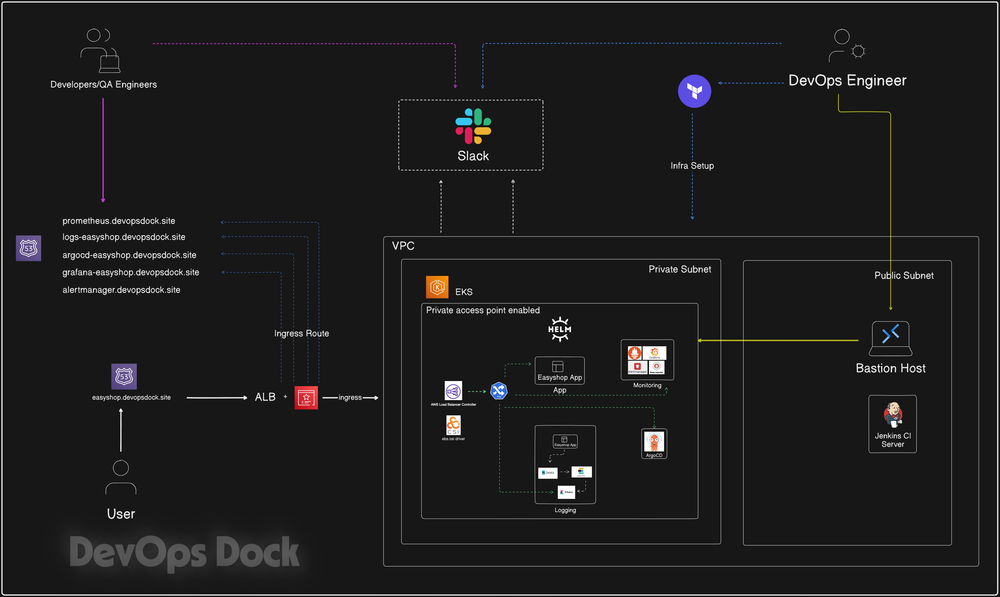
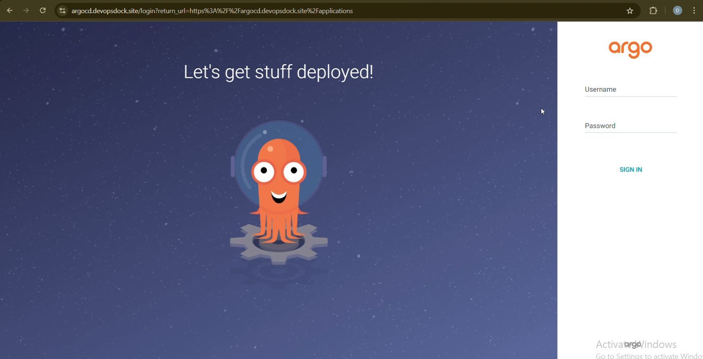
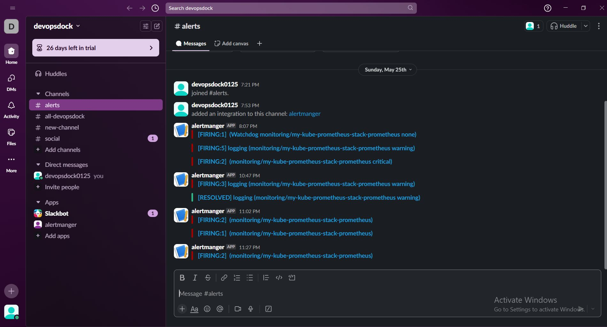
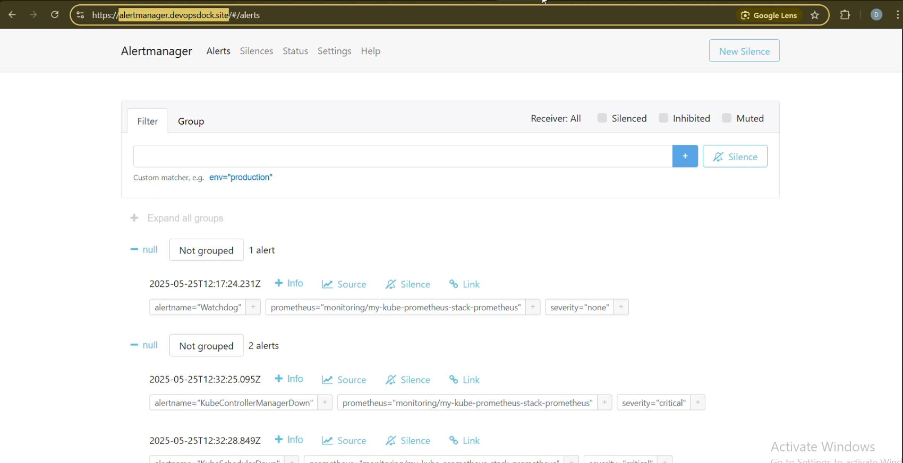
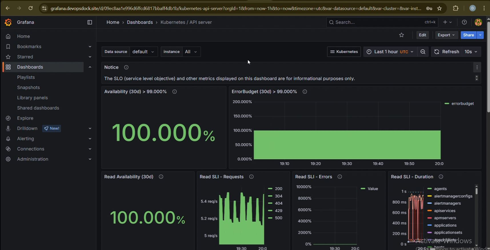
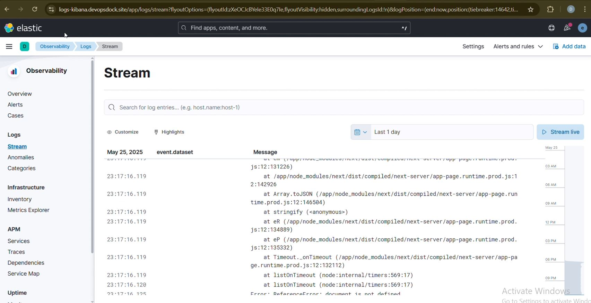
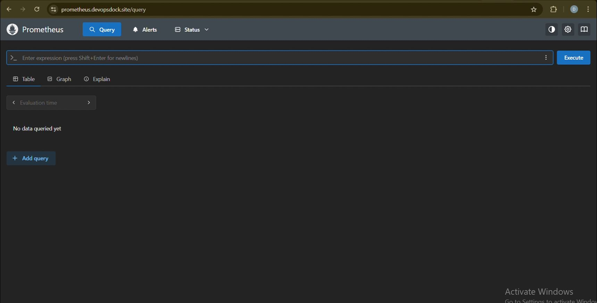

# 🛍️ EasyShop — Modern E-commerce Platform on AWS EKS

[](https://nextjs.org/)
[](https://www.typescriptlang.org/)
[](https://www.mongodb.com/)
[](https://www.terraform.io/)
[](https://aws.amazon.com/eks/)
[](https://argo-cd.readthedocs.io/)
[](LICENSE)

EasyShop is a full-stack e-commerce platform (Next.js 14 + TypeScript + MongoDB) deployed on
**AWS EKS** with a complete cloud-native stack: **Terraform** for infrastructure, **ArgoCD** for
GitOps continuous delivery, **GitHub Actions** for CI, **Prometheus/Grafana** for monitoring, and
**Elasticsearch/Kibana/Filebeat** for logging.

> **📖 This single README is the complete guide** — from cloning the repo to a fully running,
> tested deployment, and tearing it back down. If you've **never used** Terraform, Kubernetes,
> Docker, or ArgoCD before, you can still follow it end-to-end. Every step is copy-paste, in order.

---

## 📑 Table of Contents

**Part A — About the app**
1. [Features](#1-features)
2. [Application architecture](#2-application-architecture)

**Part B — Deploy it yourself (the guide)**
3. [How the whole system fits together](#3-how-the-whole-system-fits-together)
4. [Install the tools (one-time)](#4-install-the-tools-one-time)
5. [Set up your AWS account](#5-set-up-your-aws-account)
6. [⚙️ Configuration you MUST edit](#6-configuration-you-must-edit)
7. [Step 1 — Create the network + cluster](#7-step-1--create-the-network--cluster)
8. [Step 2 — Connect kubectl](#8-step-2--connect-kubectl)
9. [Step 3 — Install the add-ons](#9-step-3--install-the-add-ons)
10. [Step 4 — Deploy the EasyShop app](#10-step-4--deploy-the-easyshop-app)
11. [Step 5 — Set up CI/CD](#11-step-5--set-up-cicd)

**Part C — Verify, operate, tear down**
12. [✅ Post-deployment testing (verify EVERYTHING)](#12-post-deployment-testing)
13. [📧 Optional: email alerts via Alertmanager](#13-optional-email-alerts)
14. [🔥 Teardown (stop all costs)](#14-teardown-stop-all-costs)
15. [🆘 Troubleshooting](#15-troubleshooting)
16. [📚 Glossary (for beginners)](#16-glossary)
17. [Screenshots](#17-screenshots)

---
---

# PART A — About the app

## 1. Features

- 🎨 Modern, responsive UI with dark-mode support
- 🔐 Secure JWT-based authentication
- 🛒 Real-time cart management with Redux
- 📱 Mobile-first design
- 🔍 Advanced product search & filtering
- 💳 Secure checkout flow
- 📦 Multiple product categories (seeded with **516 products**)
- 👤 User profiles & order history

## 2. Application architecture

Three-tier application:

| Tier | Technology |
|------|-----------|
| **Presentation (Frontend)** | Next.js React components, Redux state, Tailwind CSS |
| **Application (Backend)** | Next.js API routes, auth/authorization, validation, business logic |
| **Data** | MongoDB + Mongoose ODM |

The app is containerized (see `Dockerfile`, multi-stage, `node:22-alpine`) and runs as a Next.js
**standalone** build. A one-shot Kubernetes Job seeds MongoDB with product data on first deploy.

---
---

# PART B — Deploy it yourself

## 3. How the whole system fits together

```
   YOU (git push)                         AWS Cloud (ap-south-1)
        │                        ┌──────────────────────────────────────────┐
        ▼                        │  VPC (private network)                     │
  ┌───────────┐   builds image   │   ┌────────────────────────────────────┐  │
  │  GitHub   │──────────────►   │   │  EKS Kubernetes Cluster            │  │
  │  Actions  │   pushes to      │   │                                    │  │
  │  (CI)     │   Docker Hub     │   │  ┌──────────┐   ┌───────────────┐  │  │
  └─────┬─────┘                  │   │  │ EasyShop │   │ ArgoCD (CD)   │  │  │
        │ commits new image tag  │   │  │  + Mongo │◄──│ watches git,  │  │  │
        │ to kubernetes/ folder  │   │  └────┬─────┘   │ auto-deploys  │  │  │
        ▼                        │   │       │         └───────────────┘  │  │
  ┌───────────┐                  │   │  ┌────┴──────────────────────────┐ │  │
  │  Git repo │◄─────────────────┼───│  │ Prometheus/Grafana, ELK logs  │ │  │
  │ (this one)│   ArgoCD pulls   │   │  └───────────────────────────────┘ │  │
  └───────────┘                  │   │            ▲                        │  │
                                 │   └────────────┼────────────────────────┘  │
                                 │      ALB (load balancer, public URL)       │
                                 └──────────────────────────────────────────┘
                                                  ▲
                                          Your browser (app + dashboards)
```

**Two separate automation systems — don't confuse them:**

| System | Tool | What it does | How you run it |
|--------|------|--------------|----------------|
| **Infrastructure** | Terraform | Creates VPC, EKS, add-ons | **Manually** (Steps 1 & 3 below) |
| **App delivery (CD)** | GitHub Actions + ArgoCD | Builds app image, auto-deploys on git push | **Automatic** once set up |

> The **app** deploys itself via GitOps after setup. The **infrastructure** is applied by hand
> (Steps 1–3). Region used throughout: **`ap-south-1`** — change consistently if you use another.
>
> ⏱️ **Total time:** ~45–60 min (EKS alone takes ~15–20 min). 💰 **Cost:** ~**$0.50–1.00/hour** —
> **[tear it down](#14-teardown-stop-all-costs) when done.**

---

## 4. Install the tools (one-time)

Install these, then verify each with its version command:

| Tool | For | Install | Verify |
|------|-----|---------|--------|
| **AWS CLI v2** | Talk to AWS | [docs](https://docs.aws.amazon.com/cli/latest/userguide/getting-started-install.html) | `aws --version` |
| **Terraform** ≥1.3 | Create infrastructure | [docs](https://developer.hashicorp.com/terraform/install) | `terraform version` |
| **kubectl** | Control Kubernetes | [docs](https://kubernetes.io/docs/tasks/tools/) | `kubectl version --client` |
| **Git** | Clone this repo | [docs](https://git-scm.com/downloads) | `git --version` |
| **Docker** *(optional)* | Only for local image builds | [docs](https://docs.docker.com/get-docker/) | `docker --version` |

> 💡 **Windows:** run everything in **Git Bash** (ships with Git), not PowerShell/CMD — the
> commands use Unix syntax (`$(...)`, `export`, `openssl`, etc.).

**Clone the repo:**
```bash
git clone https://github.com/Sayajirao/tws-e-commerce-app_hackathon_Sayajirao.git
cd tws-e-commerce-app_hackathon_Sayajirao
```

---

## 5. Set up your AWS account

You need an AWS account with an **IAM user or SSO role that has broad/admin permissions** (it
creates VPC, EKS, IAM roles, EC2, load balancers).

```bash
# Configure credentials (region = ap-south-1):
aws configure                 # or: aws configure sso

# Confirm you're on the RIGHT account (note the account number printed):
aws sts get-caller-identity
```
> 💡 Multiple accounts? Use a named profile and prefix commands with `export AWS_PROFILE=yourprofile`.

**Create the S3 bucket that stores Terraform state** (its record of what it built). Names are
globally unique — pick your own suffix:
```bash
aws s3 mb s3://easyshop-tfstate-<your-unique-suffix> --region ap-south-1
```

---

## 6. ⚙️ Configuration you MUST edit

**This is the most important section — skipping it causes ~90% of failures.** Edit each value
to match your account/environment.

### 6.1 — Terraform state bucket → `terraform/terraform.tf`
```hcl
backend "s3" {
  bucket       = "easyshop-tfstate-sayajirao"   # ← YOUR bucket from Step 5
  key          = "eks/terraform.tfstate"
  region       = "ap-south-1"                    # ← your region
  use_lockfile = true
}
```

### 6.2 — Who can reach the cluster API → `terraform/variables.tf`
Find your public IP, then set `cluster_public_access_cidrs`:
```bash
curl -s checkip.amazonaws.com
```
```hcl
variable "cluster_public_access_cidrs" {
  default = ["<YOUR_IP>/32"]     # e.g. ["203.0.113.45/32"]
}
```
> ⚠️ Home IPs change. If `kubectl` later hangs/times out, re-run `checkip` and update this,
> then `terraform apply` again. (`["0.0.0.0/0"]` allows any IP — convenient, less secure;
> IAM still gates real access.)

### 6.3 — ALB Controller region + VPC ID → `terraform/apps/helm-values/alb_controller-1.13.3.yaml`
```yaml
region: "ap-south-1"                 # ← your region
vpcId: "vpc-0512319ee6625c8e4"       # ← CHANGE to your real VPC (Step 1 output `vpc_id`)
clusterName: "tws-eks-cluster"       # leave unless you rename the cluster
```
> You get the real `vpcId` **after** Step 1. Come back and set it before Step 3. Wrong value → ALB controller CrashLoops.

### 6.4 — App domain (optional) → `kubernetes/04-configmap.yaml`
Replace `easyshop.devopsdock.site` with your domain if you own one. **No domain? Leave it** — the
app works over the ALB's auto-generated URL (HTTP only).

### 6.5 — ArgoCD repo + branch → `argocd/easyshop-application.yaml`
```yaml
repoURL: https://github.com/Sayajirao/tws-e-commerce-app_hackathon_Sayajirao.git  # ← YOUR fork
targetRevision: dev      # branch ArgoCD watches & deploys from
```
> Forked the repo? Point `repoURL` at **your** fork so ArgoCD deploys your commits.

---

## 7. Step 1 — Create the network + cluster

Builds the VPC + EKS cluster. **~15–20 minutes.**
```bash
cd terraform
terraform init      # downloads providers, connects to your S3 state bucket
terraform plan      # PREVIEW: VPC, EKS, 2× t3.xlarge nodes
terraform apply     # type 'yes' — go get a coffee ☕
```
When done, copy the outputs (you need `vpc_id`):
```bash
terraform output
```
> 📌 **Now go back to [6.3](#63--alb-controller-region--vpc-id--terraformappshelm-valuesalb_controller-1133yaml)**
> and paste the real `vpc_id` into the ALB controller values file.

---

## 8. Step 2 — Connect kubectl

```bash
aws eks --region ap-south-1 update-kubeconfig --name tws-eks-cluster
kubectl get nodes         # expect 2 nodes, both "Ready" (may take a minute)
```
> ❌ Hangs / "Unauthorized" / "timeout"? Your IP isn't whitelisted → re-check [6.2](#62--who-can-reach-the-cluster-api--terraformvariablestf).

---

## 9. Step 3 — Install the add-ons

Installs AWS Load Balancer Controller, EBS CSI driver, ArgoCD, Prometheus/Grafana, and ELK
(all Helm charts, applied by Terraform).

**9.1 — Give Terraform the cluster's OIDC ID** (for IAM/IRSA):
```bash
aws eks describe-cluster --name tws-eks-cluster --region ap-south-1 \
  --query "cluster.identity.oidc.issuer" --output text
# → https://oidc.eks.ap-south-1.amazonaws.com/id/ABCD1234....
```
Edit `terraform/apps/variables.tf` → `idp_provider_url`, paste that value **without** `https://`:
```hcl
default = "oidc.eks.ap-south-1.amazonaws.com/id/ABCD1234...."
```

**9.2 — Apply the add-ons:**
```bash
cd apps               # now in terraform/apps
terraform init
terraform apply       # type 'yes' — ~5-10 min
```

**9.3 — Verify:**
```bash
kubectl get pods -A   # kube-system, argocd, monitoring, logging all Running/Completed
kubectl get sc        # a StorageClass marked (default)
```
> 🐛 Kibana stuck? Known chart quirk — see [Troubleshooting → Kibana](#kibana-stuck-or-503). Others can proceed meanwhile.

---

## 10. Step 4 — Deploy the EasyShop app

**10.1 — Create app secrets (NOT in git):**
```bash
kubectl create namespace easyshop 2>/dev/null   # ok if it exists

kubectl -n easyshop create secret generic easyshop-secrets \
  --from-literal=JWT_SECRET=$(openssl rand -hex 32) \
  --from-literal=NEXTAUTH_SECRET=$(openssl rand -hex 32) \
  --dry-run=client -o yaml | kubectl apply -f -
```

**10.2 — Deploy app + database:**
```bash
cd ../..                    # repo root
kubectl apply -f kubernetes/
kubectl -n easyshop get pods -w    # Ctrl+C to stop watching
```
Wait for: `mongodb-0` Running, `easyshop-*` Running (2), `db-migration` **Completed**.

**10.3 — Confirm the DB seeded (516 products):**
```bash
kubectl -n easyshop logs job/db-migration | tail   # look for "Migrated 516 products"
```
> 🐛 Migration failed with `ECONNREFUSED` (ran before Mongo was ready)? Re-run it:
> ```bash
> kubectl -n easyshop delete job db-migration
> kubectl apply -f kubernetes/12-migration-job.yaml
> ```

---

## 11. Step 5 — Set up CI/CD

**11.1 — Add Docker Hub credentials to GitHub** (repo → **Settings → Secrets and variables →
Actions → New repository secret**):

| Secret | Value |
|--------|-------|
| `DOCKERHUB_USERNAME` | your Docker Hub username (lowercase) |
| `DOCKERHUB_TOKEN` | a Docker Hub **access token** (`dckr_pat_...`), **Read & Write** |

> Get the token: Docker Hub → **Account Settings → Personal access tokens → Generate**.
> ✅ **Verify it before relying on it:** `docker login -u YOUR_USERNAME` (paste token at prompt) → must say `Login Succeeded`.

**11.2 — Register the app with ArgoCD (one-time):**
```bash
kubectl apply -f argocd/easyshop-application.yaml
kubectl -n argocd get application easyshop     # expect Synced / Healthy
```

**11.3 — How the pipeline works:**
```
edit code in src/  →  push / merge to `dev`
   → GitHub Actions: build image, scan with Trivy (security), push to Docker Hub
   → GitHub Actions: rewrite image tag in kubernetes/08-easyshop-deployment.yaml, commit it
   → ArgoCD (watching `dev`): sees the commit, syncs, rolls the pods  →  change is live
```
- CI config: `.github/workflows/ci.yaml`
- **Pull Request** → build + scan only (no deploy). **Merge to `dev`/`main`** → full build + push + deploy.
- Accepted security findings documented in `.trivyignore`.

---
---

# PART C — Verify, operate, tear down

## 12. Post-deployment testing

**This proves the whole system works. Run top to bottom.**

### ✅ 12.1 — Cluster & pods healthy
```bash
kubectl get nodes
kubectl get pods -A | grep -v Running | grep -v Completed   # should be ~empty
```

### ✅ 12.2 — Get the public URL
```bash
kubectl -n easyshop get ingress    # wait for the ADDRESS column (1-3 min)
ALB=$(kubectl -n easyshop get ingress easyshop-ingress \
      -o jsonpath='{.status.loadBalancer.ingress[0].hostname}')
echo "App URL: http://$ALB/"
```

### ✅ 12.3 — App responds over the internet
```bash
curl -sI http://$ALB/                            # expect HTTP/1.1 200 OK
curl -s  http://$ALB/api/products | head -c 300  # expect product JSON from MongoDB
```
Then open **`http://$ALB/`** in a browser — storefront loads with products.

### ✅ 12.4 — Dashboards (shared ALB, by path)
```bash
echo "App:        http://$ALB/"
echo "Grafana:    http://$ALB/grafana      (user: admin)"
echo "ArgoCD:     http://$ALB/argocd       (user: admin)"
echo "Kibana:     http://$ALB/kibana"
echo "Prometheus: http://$ALB/prometheus"
```
Passwords:
```bash
# ArgoCD admin:
kubectl -n argocd get secret argocd-initial-admin-secret -o jsonpath='{.data.password}' | base64 -d; echo
# Grafana admin (default):
echo "prom-operator"
```
**Check:** Grafana → a Kubernetes dashboard has data · Prometheus → Status → Targets are **UP** ·
ArgoCD → `easyshop` tile green · Kibana → Discover shows logs flowing.

### ✅ 12.5 — End-to-end CI/CD test (the real proof)
```bash
# 1. Edit a visible string, e.g. src/app/(auth)/login/page.tsx (the <p> heading).
# 2. Commit & push to dev:
git checkout dev
git add "src/app/(auth)/login/page.tsx"
git commit -m "test: verify CI/CD pipeline end-to-end"
git push
# 3. Watch GitHub → Actions: build → scan → push → tag-bump.
# 4. Watch ArgoCD adopt the new commit:
kubectl -n argocd get application easyshop -o jsonpath='SYNC={.status.sync.status} REV={.status.sync.revision}{"\n"}'
# 5. Confirm the running image tag = new commit SHA:
kubectl -n easyshop get deploy easyshop -o jsonpath='{.spec.template.spec.containers[0].image}{"\n"}'
# 6. Hard-refresh http://$ALB/login → your text change is live. 🎉
```

### ✅ 12.6 — Self-healing test (GitOps guarantee)
```bash
kubectl -n easyshop scale deploy easyshop --replicas=5   # manual drift
kubectl -n easyshop get deploy easyshop -w               # ArgoCD selfHeal reverts it (~1 min)
```

**All six pass → your deployment is fully working. ✅**

---

## 13. Optional: email alerts

Alertmanager (in `monitoring`) can email you on **critical** alerts via Gmail SMTP. Config lives in
`terraform/apps/helm-values/kube-prom-stack.yaml`; the password is read from a Kubernetes secret
(kept out of git).

```bash
# 1. Create a Gmail App Password (needs 2-Step Verification):
#    https://myaccount.google.com/apppasswords
# 2. Create the secret the config expects:
kubectl -n monitoring create secret generic alertmanager-smtp \
  --from-literal=password='<YOUR_16_CHAR_APP_PASSWORD>'
# 3. Re-apply so Alertmanager picks it up:
cd terraform/apps && terraform apply
```
> The values file already sets `to`/`from`/`smarthost: smtp.gmail.com:587` and mounts the secret
> via `alertmanagerSpec.secrets`. Edit the email address there to your own.
> Without this secret, Alertmanager logs SMTP failures (harmless but noisy).

---

## 14. Teardown (stop all costs)

**⚠️ Do this when done — ~$0.50–1/hr.** Delete in reverse order:
```bash
# 1. App first (releases the ALB so it isn't orphaned):
kubectl delete -f kubernetes/
# 2. Add-ons:
cd terraform/apps && terraform destroy      # type 'yes'
# 3. Cluster + VPC:
cd .. && terraform destroy                  # type 'yes'
```
**Verify nothing costly lingers** (orphaned LBs are the usual money leak):
```bash
aws elbv2 describe-load-balancers --region ap-south-1 --query 'LoadBalancers[].LoadBalancerName'
aws ec2 describe-instances --region ap-south-1 \
  --filters "Name=instance-state-name,Values=running" --query 'Reservations[].Instances[].InstanceId'
```
Both should be empty. Delete a lingering LB in the Console (EC2 → Load Balancers). Optionally drop
the state bucket: `aws s3 rb s3://<your-bucket> --force`.

---

## 15. Troubleshooting

<details><summary><b>kubectl hangs / "Unauthorized" / "timeout"</b></summary>

Your IP isn't allowed to reach the EKS API. Update `terraform/variables.tf →
cluster_public_access_cidrs` with `curl -s checkip.amazonaws.com`, then `terraform apply` in `terraform/`.
</details>

<details><summary><b>ALB Controller CrashLooping (kube-system)</b></summary>

Wrong `vpcId`/`region` in `terraform/apps/helm-values/alb_controller-1.13.3.yaml`. Set `vpcId` to
your real VPC (`terraform output vpc_id`), then `terraform apply` in `terraform/apps`.
</details>

<details><summary><b>Ingress has no ADDRESS / URL won't resolve</b></summary>

ALB takes 1–3 min. If it never appears, the ALB controller is unhealthy (above). Check:
`kubectl -n kube-system logs deploy/aws-load-balancer-controller`.
</details>

<details><summary><b>Dashboard 404 (e.g. /grafana)</b></summary>

On the shared ALB, the app's catch-all `/*` must sort LAST via
`alb.ingress.kubernetes.io/group.order` (app=`100`, dashboards=`10`–`13`). A 404 whose response
header shows `X-Powered-By: Next.js` means the path hit the app — fix the order.
</details>

<details><summary><b id="kibana-stuck-or-503">Kibana stuck / 503</b></summary>

The chart re-runs a token hook that conflicts with the existing secret on re-apply:
```bash
kubectl -n logging delete secret kibana-kibana-es-token 2>/dev/null
kubectl -n logging delete job,configmap,sa,role,rolebinding -l app=pre-install-kibana-kibana 2>/dev/null
cd terraform/apps && terraform apply
kubectl -n logging rollout restart deployment kibana-kibana
```
</details>

<details><summary><b>CI fails: "unauthorized: incorrect username or password"</b></summary>

`DOCKERHUB_TOKEN` is wrong/expired, or `DOCKERHUB_USERNAME` is an email not the username.
Regenerate a Read&Write token on Docker Hub, update the repo secret. Test: `docker login -u YOUR_USERNAME`.
</details>

<details><summary><b>Trivy fails the CI build on CVEs</b></summary>

Trivy is doing its job. Either patch the flagged dependency/base image, or add a justified entry to
`.trivyignore`. The image uses `node:22-alpine`; app deps pinned to patched versions.
</details>

<details><summary><b>ArgoCD "OutOfSync" and won't update</b></summary>

Force a refresh:
```bash
kubectl -n argocd annotate application easyshop argocd.argoproj.io/refresh=hard --overwrite
```
Confirm `targetRevision` in `argocd/easyshop-application.yaml` matches the branch you push to.
</details>

---

## 16. Glossary

| Term | Plain-English meaning |
|------|----------------------|
| **VPC** | Your private network inside AWS. |
| **EKS** | AWS's managed Kubernetes — runs your containers. |
| **Kubernetes / kubectl** | The container orchestrator; `kubectl` is the command to control it. |
| **Terraform** | Creates cloud infrastructure from code (`.tf` files). |
| **Terraform state** | Terraform's record (stored in S3) of what it built. |
| **Helm chart** | A packaged Kubernetes app (used for the add-ons). |
| **Pod** | One or more running containers — smallest unit in Kubernetes. |
| **Namespace** | A folder that groups Kubernetes resources. |
| **Ingress / ALB** | Public entry point; ALB = AWS load balancer giving you a URL. |
| **ArgoCD** | Watches git and auto-deploys changes to the cluster (GitOps). |
| **CI / CD** | CI = build & test on push; CD = auto-deploy. |
| **Docker image / tag** | A packaged app; the tag (a git SHA here) identifies the version. |
| **IRSA / OIDC** | How a pod securely gets AWS permissions without stored keys. |
| **Trivy** | Scans container images for security vulnerabilities. |
| **Secret** | Sensitive config (passwords, keys) stored securely in Kubernetes. |

---

## 17. Screenshots

| | |
|---|---|
| **Storefront** |  |
| **Architecture** |  |
| **ArgoCD** |  |
| **App capture** |  |
| **AlertManager** |  |
| **Grafana** |  |
| **Kibana** |  |
| **Prometheus** |  |

---

*Built with Next.js · MongoDB · Docker · Terraform · AWS EKS · ArgoCD · GitHub Actions ·
Prometheus/Grafana · Elasticsearch/Kibana/Filebeat.*
*Infrastructure automation (Terraform-in-CI) is a planned enhancement — infra is currently applied manually per Steps 1–3.*
